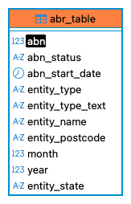
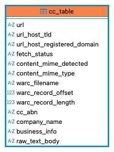

# Business Data Aggregator for Australia

This project is an ETL pipeline that extracts, processes, and aggregates business data from the Australian Business Register (ABR) and the Common Crawl web archive. The pipeline is orchestrated with Apache Airflow and uses Apache Spark for distributed data processing.





## Table of Contents
- [Database Schema](#database-schema)
- [Pipeline Architecture](#pipeline-architecture)
- [Technology Justification](#technology-justification)
- [AI Model Used & Rationale](#ai-model-used--rationale)
- [Setup and Running Instructions](#setup-and-running-instructions)
- [Python Scripts for Data Extraction](#python-scripts-for-data-extraction)

## Database Schema

The project uses a PostgreSQL database with two main tables:

### `abr_table`

This table stores data from the Australian Business Register.

**DDL:**
```sql
CREATE TABLE abr_table (
    abn BIGINT,
    abn_status VARCHAR(255),
    abn_start_date DATE,
    entity_type VARCHAR(255),
    entity_type_text VARCHAR(255),
    entity_name VARCHAR(255),
    entity_state VARCHAR(255),
    entity_postcode VARCHAR(255),
    year INTEGER,
    month INTEGER
);
```

### `cc_table`

This table stores data extracted from the Common Crawl web archive.

**DDL:**
```sql
CREATE TABLE cc_table (
    url TEXT,
    url_host_tld VARCHAR(255),
    url_host_registered_domain VARCHAR(255),
    fetch_status VARCHAR(255),
    content_mime_detected VARCHAR(255),
    content_mime_type VARCHAR(255),
    warc_filename VARCHAR(255),
    warc_record_offset BIGINT,
    warc_record_length BIGINT,
    cc_abn VARCHAR(255),
    company_name VARCHAR(255),
    business_info TEXT,
    raw_text_body TEXT
);
```

## Pipeline Architecture

The data pipeline is orchestrated using Apache Airflow and consists of three main DAGs:

1.  **`AU_Australian_Business_Register_DAG`**:
    *   Downloads zipped XML files containing Australian Business Register (ABR) data from `data.gov.au`.
    *   Unzips the downloaded files.
    *   Processes the XML files in batches using Spark, parsing them into a DataFrame with a defined schema.
    *   Filters for active businesses, casts data types, and enriches the data with year and month columns.
    *   Writes the processed ABR data to a partitioned Parquet file in the `shared-data-volume/abr/abr_tbl` directory.
    *   Loads the data from the Parquet file into the `abr_table` in PostgreSQL.

2.  **`AU_Common_Crawl_DAG`**:
    *   Fetches a list of WARC file paths from the Common Crawl index for a specific crawl (`CC-MAIN-2025-13`).
    *   Uses DuckDB to process these index files, filtering for URLs with the `.au` top-level domain and keywords related to contact information, about pages, etc. This step identifies potential business websites.
    *   The results of this filtering are saved as smaller Parquet files.
    *   These smaller parquet files are then split into even smaller chunks to be processed in parallel.
    *   Each chunk is processed by a Spark task (`process_single_file`) which:
        *   Fetches the raw web page content from the Common Crawl WARC files.
        *   Extracts business information (ABN, company name, etc.) from the web page content.
        *   Saves the extracted information into a new Parquet file.
    *   The processed Parquet files are merged.
    *   The merged data is loaded into the `cc_table` in PostgreSQL.

3.  **`PROCESS_Parquet_AND_push_to_DB`**:
    *   This DAG is a utility DAG to load the Parquet files from both ABR and Common Crawl processing into the `abr_table` and `cc_table` in PostgreSQL.

## Technology Justification

-   **Apache Airflow**: Used as the orchestrator for the entire ETL pipeline. It defines the workflows (DAGs) for data extraction, processing, and loading.
-   **Apache Spark**: Used for distributed processing of large datasets. It's used to process both the ABR XML data and the Common Crawl data. The use of Spark allows for scalable and efficient processing of the data.
-   **DuckDB**: Used for efficient querying of the Common Crawl index files. DuckDB is an in-process analytical database that is very fast for OLAP queries.
-   **PostgreSQL**: Used as the target database to store the processed data.
-   **requests**: Used to download files from the internet.
-   **BeautifulSoup**: Used for parsing HTML and XML content to extract business information from the Common Crawl data.


## AI Model Used & Rationale

The project uses two pre-trained models from the Hugging Face `transformers` library for NLP tasks:

1.  **`dbmdz/bert-large-cased-finetuned-conll03-english`**: A Named Entity Recognition (NER) model. This is used to identify entities like company names, locations, etc., from the text content of websites.
2.  **`facebook/bart-large-mnli`**: A Zero-Shot Classification model. This model is used to classify the industry of a business based on the text from its website.

**Rationale:**

-   The **NER model** is used to extract structured information from unstructured text. This is a crucial step in identifying key business details from web page content.
-   The **Zero-Shot Classification model** is used to categorize businesses into industries without needing a pre-trained model for that specific task. This is a flexible approach that allows for classification with a custom set of labels.

## Setup and Running Instructions

1.  **Environment Setup**:
    *   Create a `.env` file from the `.env.sample` file and update the variables as needed.
    *   Set the `AIRFLOW_PROJ_DIR` environment variable to your project directory.

2.  **Docker Compose**:
    *   The project is containerized using Docker Compose.
    *   Make sure you have Docker and Docker Compose installed.

3.  **Running the project**:
    *   Run the following command to start the services:
        ```bash
        docker-compose up -d
        ```
    *   The Airflow UI will be available at `http://localhost:8080`. The default credentials are `airflow` / `airflow`.

4.  **Connections**:
    *   The `target_postgres` connection is automatically created by the `airflow-init` service.
    *   You can also manually create the connections by following the instructions in the `connections.md` file.

## Python Scripts for Data Extraction

The main Python scripts for data extraction and processing are located in the `dags/` directory:

-   `au_australian_business_register_dag.py`: DAG for processing data from the Australian Business Register.
-   `au_common_crawl_dag.py`: DAG for processing data from the Common Crawl.
-   `push_to_db_dag.py`: DAG for loading data into the PostgreSQL database.
-   `job_business_extract.py`: Contains the core logic for extracting business information from web page content.
-   `utils.py`: Contains utility functions used by the DAGs.